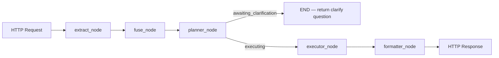
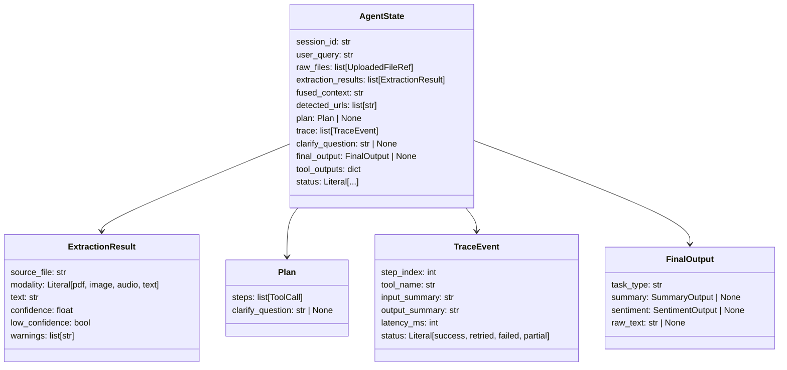

# Multimodal Agent

A production-ready, LangGraph-orchestrated multimodal agentic assistant built on FastAPI. Accepts PDF documents, images, audio files, and plain text; constructs a structured tool execution plan via Gemini 2.5 Flash; executes the plan through a registry of six specialised tools; and returns a validated, display-ready final output.

---

## Architecture

The pipeline is a five-node LangGraph `StateGraph` compiled against a `MemorySaver` checkpointer. All tool dispatch, retry, and conditional branching logic lives in plain Python inside the nodes — LangGraph is used strictly as a coarse state-machine scheduler (see Decision 1).



**Execution flow in detail:**

| Node | Responsibility |
|---|---|
| `extract_node` | Dispatches each uploaded file to the matching extractor (PDF, image, audio, or raw text) concurrently via `asyncio.gather`. Partial extraction failures are recorded in the trace with `status=partial`; the graph continues rather than aborting. |
| `fuse_node` | Merges all extracted texts into a single `fused_context` string and collects any URLs found in the query or document bodies. |
| `planner_node` | Sends the fused context, user query, detected URLs, and the full tool schema to Gemini 2.5 Flash. Parses the structured JSON plan response. If the request is ambiguous the planner returns a `clarify_question` instead of steps; the graph ends immediately and the UI surfaces the question. |
| `executor_node` | Runs each planned tool step sequentially. On first-attempt failure the error message is injected back into the step args as `_retry_error_context` (Reflexion retry). A step that fails both attempts records `status=partial` in the trace. |
| `formatter_node` | Shapes the raw `tool_outputs` dict into a typed `FinalOutput` Pydantic model (`SummaryOutput`, `SentimentOutput`, or raw text) for the API response. |

### Clarify-Pause / Resume Path

When `planner_node` sets `status=awaiting_clarification`, the graph reaches `END` and the `/session` endpoint returns a 200 with `status=awaiting_clarification` and the clarifying question. The client sends the user's answer to `/reply/{thread_id}`, which calls `graph.aupdate_state(config, updates, as_node="fuse_context")` then `graph.ainvoke(None, config=config)` to resume from `planner_node` without re-executing `extract_node`. This is empirically verified in `test_real_graph_resume_does_not_re_extract` (Decision 11).

---

## Repository Layout

```
multimodal-agent/
├── app/
│   ├── schemas/           # Pydantic models and TypedDict AgentState
│   │   ├── extraction.py  # ExtractionResult
│   │   ├── plan.py        # Plan, ToolCall
│   │   ├── trace.py       # TraceEvent
│   │   ├── output.py      # SummaryOutput, SentimentOutput, FinalOutput
│   │   ├── state.py       # AgentState, UploadedFileRef
│   │   └── __init__.py
│   ├── extractors/        # Per-modality extractors
│   │   ├── pdf_extractor.py   # pdfplumber + Tesseract OCR + Gemini vision fallback
│   │   ├── image_extractor.py # Tesseract OCR + Gemini vision fallback
│   │   └── audio_extractor.py # faster-whisper (base/int8) + Gemini cleanup pass
│   ├── graph/
│   │   ├── nodes.py       # Five async node functions
│   │   └── build.py       # StateGraph assembly and compilation
│   ├── tools/
│   │   ├── registry.py    # TOOL_REGISTRY and dispatch_tool
│   │   ├── summarize.py
│   │   ├── sentiment.py
│   │   ├── code_explain.py
│   │   ├── youtube_transcript.py
│   │   ├── cross_compare.py
│   │   └── conversational.py
│   ├── main.py            # FastAPI application, startup, endpoints
│   ├── upload_validation.py   # Streaming MIME sniff and size enforcement
│   └── logging_utils.py   # Structured JSON event logging
├── tests/
│   ├── test_api.py        # Integration tests (session, reply, trace, resume)
│   ├── test_graph.py      # Node and routing unit tests
│   ├── test_tools.py      # Tool and registry unit tests
│   ├── test_extractors.py # Extractor unit tests
│   └── test_schemas.py    # Schema validation unit tests
├── prompts/               # Versioned prompt templates (one file per tool/extractor)
├── decisions.md           # Architectural Decision Records (ADRs 1–12)
├── flow.md                # Graph execution flow documentation
├── requirements.txt       # Pinned Python dependencies (Decision 11)
├── Dockerfile             # python:3.12.13-slim + tesseract-ocr + ffmpeg
└── .env.example           # Environment variable reference
```

---

## Schema Overview



---

## Tool Registry

Six tools are registered in `app/tools/registry.py`. The `needs_gemini` flag controls whether `dispatch_tool` injects the Gemini client — tools that call the Gemini API are marked `True`; `fetch_youtube_transcript` uses only the YouTube Transcript API and is marked `False`.

| Tool name | Accepts | Returns | Needs Gemini |
|---|---|---|---|
| `summarize` | `text: str` | `SummaryOutput` (one-line, 3 bullets, 5-sentence para) | Yes |
| `sentiment` | `text: str` | `SentimentOutput` (label, confidence, justification) | Yes |
| `code_explain` | `text: str` | `str` (explanation + bugs + complexity) | Yes |
| `fetch_youtube_transcript` | `url: str` | `str` (full transcript text) | No |
| `cross_compare` | `text_a: str`, `text_b: str` | `dict` (shared themes, differences, summary) | Yes |
| `conversational_answer` | `query: str`, `context: str` | `str` (grounded answer) | Yes |

Every Gemini-dependent tool makes up to 2 attempts (1 Reflexion retry) and returns a typed fallback value on failure — the formatter never receives `None` (Decision 8).

---

## API Endpoints

| Method | Path | Description |
|---|---|---|
| `GET` | `/health` | Returns `{"status":"healthy","gemini_configured":true}` |
| `GET` | `/` | Serves the static frontend (`app/static/index.html`) |
| `POST` | `/session` | Start a new session. Accepts `multipart/form-data` with `user_query: str` and optional `files: list[UploadFile]`. Returns `SessionResponse`. |
| `POST` | `/reply/{thread_id}` | Continue an `awaiting_clarification` session. Accepts `user_reply: str`. Returns `SessionResponse`. |
| `GET` | `/trace/{thread_id}` | Return the trace list for a completed session. |

**`SessionResponse` schema:**
```json
{
  "status": "done | awaiting_clarification | error",
  "thread_id": "uuid",
  "output": { ... },
  "question": "string | null",
  "trace": [ ... ]
}
```

### Upload Constraints

- Maximum file size: **10 MB per file** (streaming enforcement — never fully buffered in RAM)
- Accepted MIME types (sniffed from file headers, not declared content-type): PDF, PNG, JPEG, GIF, WEBP, WAV, FLAC, OGG, MP3
- Plain text files (`.txt`, `.md`, etc.) are accepted without MIME sniffing

---

## Local Development

### Prerequisites

- Python 3.12.13
- [Tesseract OCR](https://github.com/UB-Mannheim/tesseract/wiki) (Windows: install to a known path and set `TESSERACT_CMD`; Docker/Linux: installed via `apt-get`)
- FFmpeg (required by faster-whisper for audio decoding)
- A Google Gemini API key (set `GEMINI_API_KEY` in `.env`)

### Setup

```bash
# 1. Create and activate a virtual environment
python -m venv .venv
# Windows:
.venv\Scripts\activate
# Linux / macOS:
source .venv/bin/activate

# 2. Install pinned dependencies
pip install -r requirements.txt

# 3. Configure environment variables
cp .env.example .env
# Edit .env and fill in GEMINI_API_KEY and TESSERACT_CMD (Windows only)

# 4. Start the development server
uvicorn app.main:app --reload --port 8000
```

The Swagger UI is available at `http://localhost:8000/docs`.

### Environment Variables & Key Supply

Gemini API keys can be supplied in two ways:
1. **Server Environment Variable**: Set `GEMINI_API_KEY` (or `GOOGLE_API_KEY`) in `.env` or server environment variables.
2. **Per-User Request Header**: Users can supply their own key via the UI **Settings** panel (or via the `X-Gemini-Api-Key` HTTP header). The custom key overrides the server default and is held strictly in JS memory for the active session (never logged or stored on disk).

| Variable / Header | Required | Description |
|---|---|---|
| `X-Gemini-Api-Key` | Header (Optional) | Per-user custom Gemini API key sent with `/session` and `/reply` fetch requests. Overrides server default. |
| `GEMINI_API_KEY` | Server (Optional) | Server-wide default Gemini API key. Used if no `X-Gemini-Api-Key` header is provided. |
| `TESSERACT_CMD` | Windows only | Absolute path to `tesseract.exe` (e.g. `C:\Program Files\Tesseract-OCR\tesseract.exe`). Docker/Linux does not need this — Tesseract is installed via `apt-get`. |
| `PORT` | No | Server port (defaults to 8000; Render supplies this automatically) |

---

## Testing

```bash
# Run the full suite with coverage
python -m pytest -v --cov=app --cov-report=term-missing

# Run a specific test file
python -m pytest tests/test_api.py -v
```

**Current results:** 63 tests pass, 80% line coverage, 0 failures.

Coverage gaps are in extractor Gemini fallback branches (require live API or complex mocks), MIME sniff branches for less-common formats, and the error path of `dispatch_tool` when a tool raises on both retries — none of these are untested *paths* (the outer logic is covered); the specific fallback return lines are the uncovered statements.

---

## Docker

```bash
# Build
docker build -t multimodal-agent .

# Run
docker run -p 8000:8000 --env-file .env multimodal-agent
```

The Dockerfile pre-bakes the faster-whisper `base` int8 model during build (`ENV HF_HOME=/opt/huggingface`) to eliminate cold-start model downloads on Render.

---

## Deployment

**Primary:** [Render](https://render.com) free tier. Point the service at this repository; Render builds the Docker image and serves on `$PORT`.

**Fallback:** Hugging Face Spaces (Docker SDK) if the Render free-tier 512 MB RAM ceiling causes OOM during audio extraction. The faster-whisper `base/int8` model consumes approximately 150 MB, leaving ~300 MB of headroom on Render (Decision 5).

---

## Design Decisions

Full rationale for every key architectural choice is in [`decisions.md`](decisions.md). Summary:

| # | Decision | Choice |
|---|---|---|
| 1 | LangGraph usage scope | Coarse state-machine scheduler only; tool dispatch and retries in plain Python |
| 2 | Deployment target | Render free tier; HF Spaces as OOM fallback |
| 3 | Bullet count enforcement | Prompt + formatter-level, not Pydantic validator |
| 4 | File storage in state | Disk paths (not bytes) to keep state lightweight and serialisable |
| 5 | ASR model size | faster-whisper `base` + int8; ~150 MB RAM footprint |
| 6 | PDF OCR fallback granularity | Per-page, not whole-document |
| 7 | Tool schema exposure | Static dict in `registry.py`; not auto-derived from signatures |
| 8 | Retry cap | Exactly 1 (Decision 8 documents the RPM budget reasoning) |
| 9 | `tool_outputs` field | Promoted to declared `AgentState` field to survive MemorySaver checkpoint |
| 10 | Temp file cleanup | On-response via `BackgroundTask` (extractor audit confirmed no file re-reads after `extract_node`) |
| 11 | Resume mechanism | `aupdate_state` + `ainvoke(None)`; empirically verified with real `MemorySaver` |
| 12 | Upload size limit | 10 MB per file, streaming chunk enforcement |
| 13 | Per-session client construction | Header `X-Gemini-Api-Key` -> `genai.Client()` per request via `RunnableConfig`; no key string persisted |

---

## Known Limitations

- **Single worker assumed**: Render's free tier runs one process. Concurrent 10 MB audio requests are not proven safe under the 512 MB ceiling. Multi-worker deployment requires a queue/admission-control design and a load test.
- **Whisper model downloaded at build time**: The Docker build pre-bakes the model. Changing `model_size` requires a rebuild.
- **Audio cleanup requires Gemini**: If `GEMINI_API_KEY` is absent, the cleanup pass is skipped and the raw ASR transcript is returned (`low_confidence=True`).
- **PDF vision fallback requires Gemini**: Scanned-page OCR falls back to raw pytesseract output if no client is configured.
- **YouTube transcripts**: Only videos with CC captions are supported; auto-generated captions vary in quality.
