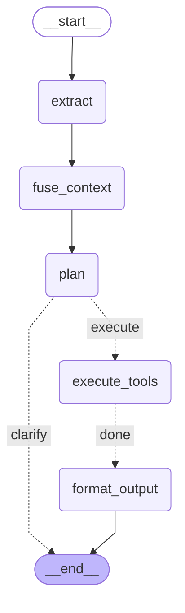

# Multimodal Agent — Graph Architecture

*Auto-generated by `scripts/export_graph.py`. Do not edit by hand.*

```mermaid
---
config:
  flowchart:
    curve: linear
---
graph TD;
	__start__([<p>__start__</p>]):::first
	extract(extract)
	fuse_context(fuse_context)
	plan(plan)
	execute_tools(execute_tools)
	format_output(format_output)
	__end__([<p>__end__</p>]):::last
	__start__ --> extract;
	execute_tools -. &nbsp;done&nbsp; .-> format_output;
	extract --> fuse_context;
	fuse_context --> plan;
	plan -. &nbsp;clarify&nbsp; .-> __end__;
	plan -. &nbsp;execute&nbsp; .-> execute_tools;
	format_output --> __end__;
	classDef default fill:#f2f0ff,line-height:1.2
	classDef first fill-opacity:0
	classDef last fill:#bfb6fc

```
